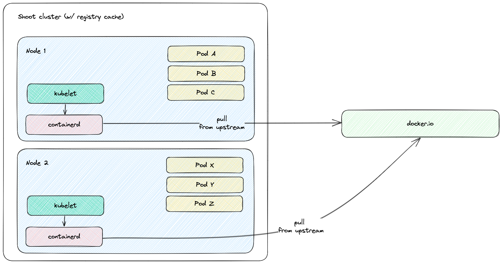
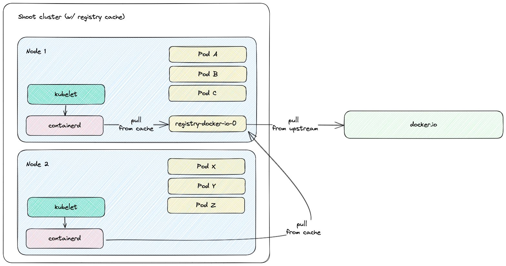

# Configuring the Registry Cache Extension

## Introduction

### Use Case

For a shoot cluster, the containerd daemon of every node goes to the internet and fetches an image that it doesn't have locally in the node's image cache. New nodes are often created due to events such as auto-scaling (scale up), rolling update, or replacement of unhealthy node. Such a new node would need to pull all of the images of the pods running on it from the internet because the node's cache is initially empty. Pulling an image from a registry produces network traffic and registry costs. To avoid these network traffic and registry costs, you can use the registry-cache extension to run a registry as pull-through cache.

The following diagram shows a rough outline of how an image pull looks like for a shoot cluster **without registry cache**:


### Solution

The registry-cache extension deploys and manages a registry in the shoot cluster that runs as pull-through cache. The used registry implementation is [distribution/distribution](https://github.com/distribution/distribution).

### How does it work?

When the extension is enabled, a registry cache for each configured upstream is deployed to the shoot cluster. Along with this, the containerd daemon on the shoot cluster nodes gets configured to use as a mirror the service IP address of the deployed registry cache. For example, if a registry cache for upstream `docker.io` is requested via the shoot spec, then containerd gets configured to first pull the image from the deployed cache in the shoot cluster. If this image pull operation fails, containerd falls back to the upstream itself (`docker.io` in that case).

The first time an image is requested from the pull-through cache, it pulls the image from the configured upstream registry and stores it locally, before handing it back to the client. On subsequent requests, the pull-through cache is able to serve the image from its own storage.

> Note: The used registry implementation ([distribution/distribution](https://github.com/distribution/distribution)) supports the mirroring of only one upstream registry.

The following diagram shows a rough outline of how an image pull looks like for a shoot cluster **with registry cache**:


## Shoot Configuration

The extension is not globally enabled and must be configured per shoot cluster. The shoot specification has to be adapted to include the `registry-cache` extension configuration.

Below is an example of `registry-cache` extension configuration as part of the shoot spec:

```yaml
apiVersion: core.gardener.cloud/v1beta1
kind: Shoot
metadata:
  name: crazy-botany
  namespace: garden-dev
spec:
  extensions:
  - type: registry-cache
    providerConfig:
      apiVersion: registry.extensions.gardener.cloud/v1alpha3
      kind: RegistryConfig
      caches:
      - upstream: docker.io
        volume:
          size: 100Gi
          storageClassName: premium
      - upstream: ghcr.io
      - upstream: quay.io
        garbageCollection:
          ttl: 0s
        secretReferenceName: quay-credentials
  # ...
  resources:
  - name: quay-credentials
    resourceRef:
      apiVersion: v1
      kind: Secret
      name: quay-credentials-v1
```

The `providerConfig` field is required.

The `providerConfig.caches` field contains information about the registry caches to deploy. It is a required field. At least one cache has to be specified.

The `providerConfig.caches[].upstream` field is the remote registry host to cache. It is a required field.
The value must be a valid DNS subdomain (RFC 1123). It must not include a scheme or port. The configured upstream registry must be accessible by `https` (`https://` is the assumed scheme).

The `providerConfig.caches[].volume` field contains settings for the registry cache volume.
The registry-cache extension deploys a StatefulSet with a volume claim template. A PersistentVolumeClaim is created with the configured size and StorageClass name.

The `providerConfig.caches[].volume.size` field is the size of the registry cache volume. Defaults to `10Gi`. The size must be a positive quantity (greater than 0).
This field is immutable. See [Increase the cache disk size](#increase-the-cache-disk-size) on how to resize the disk.
The extension defines [alerts](../../../pkg/component/registrycaches/alerting-rules/registry-cache.rules.yaml) for the volume. See [Alerting for Users](https://github.com/gardener/gardener/blob/master/docs/monitoring/alerting.md#alerting-for-users) on how to enable notifications for shoot cluster alerts.

The `providerConfig.caches[].volume.storageClassName` field is the name of the StorageClass used by the registry cache volume.
This field is immutable. If the field is not specified, then the [default StorageClass](https://kubernetes.io/docs/concepts/storage/storage-classes/#default-storageclass) will be used.

The `providerConfig.caches[].garbageCollection.ttl` field is the time to live of a blob in the cache. If the field is set to `0s`, the garbage collection is disabled. Defaults to `168h` (7 days). See the [Garbage Collection section](#garbage-collection) for more details.

The `providerConfig.caches[].secretReferenceName` is the name of the reference for the secret containing the upstream registry credentials. To cache images from a private registry, credentials to the upstream registry should be supplied. For more details, see [How to provide credentials for upstream registry](upstream-credentials.md#how-to-provide-credentials-for-upstream-registry).

> **Note**: It is only possible to provide one set of credentials for one private upstream registry.

## Garbage Collection

When the registry cache receives a request for an image that is not present in its local store, it fetches the image from the upstream, returns it to the client and stores the image in the local store. The registry cache runs a scheduler that deletes images when their time to live (ttl) expires. When adding an image to the local store, the registry cache also adds a time to live for the image. The ttl defaults to `168h` (7 days) and is configurable. The garbage collection can be disabled by setting the ttl to `0s`. Requesting an image from the registry cache does not extend the time to live of the image. Hence, an image is always garbage collected from the registry cache store when its ttl expires.
At the time of writing this document, there is no functionality for garbage collection based on disk size - e.g., garbage collecting images when a certain disk usage threshold is passed.
The garbage collection cannot be enabled once it is disabled. This constraint is added to mitigate [distribution/distribution#4249](https://github.com/distribution/distribution/issues/4249).

## Increase the Cache Disk Size

When there is no available disk space, the registry cache continues to respond to requests. However, it cannot store the remotely fetched images locally because it has no free disk space. In such case, it is simply acting as a proxy without being able to cache the images in its local store. The disk has to be resized to ensure that the registry cache continues to cache images.

There are two alternatives to enlarge the cache's disk size:

### [Alternative 1] Resize the PVC

To enlarge the PVC's size, perform the following steps:
1. Make sure that the `KUBECONFIG` environment variable is targeting the correct shoot cluster.

2. Find the PVC name to resize for the desired upstream. The below example fetches the PVC for the `docker.io` upstream:

```bash
kubectl -n kube-system get pvc -l upstream-host=docker.io
```

3. Patch the PVC's size to the desired size. The below example patches the size of a PVC to `10Gi`:

```bash
kubectl -n kube-system patch pvc $PVC_NAME --type merge -p '{"spec":{"resources":{"requests": {"storage": "10Gi"}}}}'
```

4. Make sure that the PVC gets resized. Describe the PVC to check the resize operation result:

```bash
kubectl -n kube-system describe pvc -l upstream-host=docker.io
```

> Drawback of this approach: The cache's size in the shoot spec (`providerConfig.caches[].size`) diverges from the PVC's size.

### [Alternative 2] Remove and Readd the Cache

There is always the option to remove the cache from the shoot spec and to readd it again with the updated size.

> Drawback of this approach: The already cached images get lost and the cache starts with an empty disk.

## High Аvailability

The registry cache runs with a single replica. This fact may lead to concerns for the high availability such as "What happens when the registry cache is down? Does containerd fail to pull the image?". As outlined in the [How does it work? section](#how-does-it-work), containerd is configured to fall back to the upstream registry if it fails to pull the image from the registry cache. Hence, when the registry cache is unavailable, the containerd's image pull operations are not affected because containerd falls back to image pull from the upstream registry.

## Possible Pitfalls

- The used registry implementation (the [Distribution project](https://github.com/distribution/distribution)) supports mirroring of only one upstream registry. The extension deploys a pull-through cache for each configured upstream.
- `us-docker.pkg.dev`, `europe-docker.pkg.dev`, and `asia-docker.pkg.dev` are different upstreams. Hence, configuring `pkg.dev` as upstream won't cache images from `us-docker.pkg.dev`, `europe-docker.pkg.dev`, or `asia-docker.pkg.dev`.

## Limitations

1. Images that are pulled before a registry cache pod is running or before a registry cache service is reachable from the corresponding node won't be cached - containerd will pull these images directly from the upstream.

   The reasoning behind this limitation is that a registry cache pod is running in the shoot cluster. To have a registry cache's service cluster IP reachable from containerd running on the node, the registry cache pod has to be running and kube-proxy has to configure iptables/IPVS rules for the registry cache service. If kube-proxy hasn't configured iptables/IPVS rules for the registry cache service, then the image pull times (and new node bootstrap times) will be increased significantly. For more detailed explanations, see point 2. and [PR #68 at gardener/gardener-extension-registry-cache](https://github.com/gardener/gardener-extension-registry-cache/pull/68).
   
   That's why the registry configuration on a node is applied only after the registry cache service is reachable from the node. The `configure-containerd-registries.service` systemd unit sends requests to the registry cache's service. Once the registry cache responds with `HTTP 200`, the unit creates the needed registry configuration file (`hosts.toml`).

   As a result, for images from shoot system components:
   - On shoot creation with the registry cache extension enabled, a registry cache is unable to cache all of the images from the shoot system components. Usually, until the registry cache pod is running, containerd pulls from upstream the images from shoot system components (before the registry configuration gets applied).
   - On new node creation for existing shoot with the registry cache extension enabled, a registry cache is unable to cache most of the images from shoot system components. The reachability of the registry cache service requires the service network to be set up, i.e., the kube-proxy for that new node to be running and to have set up iptables/IPVS configuration for the registry cache service.

2. containerd requests will time out in 30s in case kube-proxy hasn't configured iptables/IPVS rules for the registry cache service - the image pull times will increase significantly.

   containerd is configured to fall back to the upstream itself if a request against the cache fails. However, if the cluster IP of the registry cache service does not exist or if kube-proxy hasn't configured iptables/IPVS rules for the registry cache service, then containerd requests against the registry cache time out in 30 seconds. This significantly increases the image pull times because containerd does multiple requests as part of the image pull (HEAD request to resolve the manifest by tag, GET request for the manifest by SHA, GET requests for blobs)

   Example: If the service of a registry cache is deleted, then a new service will be created. containerd's registry config will still contain the old service's cluster IP. containerd requests against the old service's cluster IP will time out and containerd will fall back to upstream.
   - Image pull of `docker.io/library/alpine:3.13.2` from the upstream takes ~2s while image pull of the same image with invalid registry cache cluster IP takes ~2m.2s.
   - Image pull of `eu.gcr.io/gardener-project/gardener/ops-toolbelt:0.18.0` from the upstream takes ~10s while image pull of the same image with invalid registry cache cluster IP takes ~3m.10s.
